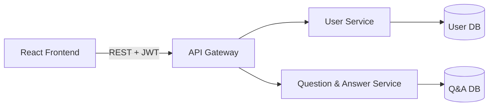

# gyandarshan

A full-stack question-and-answer web application inspired by Quora, built with a **React** front end and a **Spring Boot** microservice-based back end.

## Features

- User registration, login, and profile management
- JWT-based authentication with Spring Security
- CORS configuration for secure cross-origin requests between the React client and backend services
- Input validation on both the front end and back end

## Tech Stack

**Frontend:** React, JavaScript, HTML/CSS
**Backend:** Java, Spring Boot, Spring Security
**Server:** Eureka-Server
**API-GATEWAY:** Spring Cloud Starter Gateway Server
**Auth:** JWT (JSON Web Tokens)
**Database:** _(add: PostgreSQL )_
**Build Tools:** Maven / npm

## Architecture


> To update this diagram as service boundaries evolve.

## Services

| Service | Responsibility | Port |
|---|---|---|
| User Service | Registration, login, profile, JWT issuing | 8081 |
| Question & Answer Service | Post/view questions & answers | 8082 |
| API Gateway | Single entry point, routing | 8080 |

_(Adjust this table to match your actual services.)_

## Getting Started

### Prerequisites
- Java 17+
- Node.js 18+
- Maven
- PostgreSQL

### Backend
```bash
cd user-service
mvn spring-boot:run
```

### Frontend
```bash
cd frontend
npm install
npm start
```

## Security

- Passwords are hashed using BCrypt before storage.
- JWT tokens are issued on login and required for protected endpoints.
- CORS is configured to allow only the trusted frontend origin.

## Roadmap

- [ ] Split into additional services (e.g., Notification Service)
- [ ] Add Spring Cloud API Gateway
- [ ] Add service discovery (Eureka)
- [ ] Add Redis caching for trending questions
- [ ] Add unit and integration tests
- [ ] Dockerize services with docker-compose
- [ ] Deploy live demo

## Author

Sandip Prasad Ray — [GitHub](https://github.com/SandipRay79)
